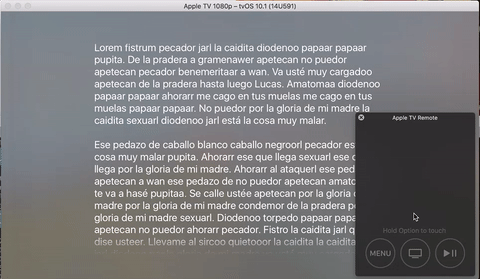

# TvOSTextViewer

Light and scrollable view controller for tvOS to present blocks of text



## Description

TvOSTextViewer is a view controller that allows presenting block of texts on the same way native Apps does on tvOS.

Customizable properties:

- text: The block of text to be presented
- textColor: The color of the text
- textEdgeInsets: Margins for the text
- font: Custom fonts/sizes can be set here
- backgroundBlurEffectStyle: .dark by default

## Requirements

- tvOS 9.0+
- Xcode 8.2

## Usage

All you need is to create an instance of TextViewerViewController and present it on the screen:

```swift
let viewController = TextViewerViewController()
viewController.text = "Hello World"
present(viewController, animated: true, completion: nil)
```

